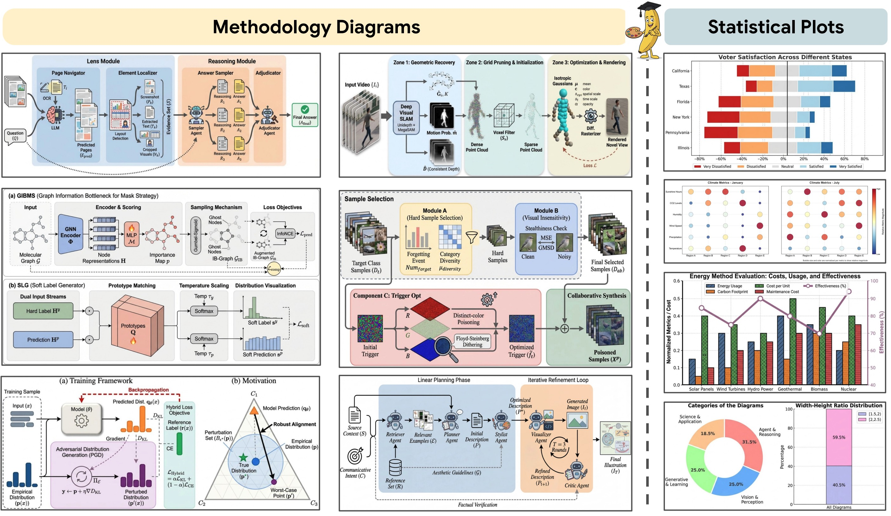
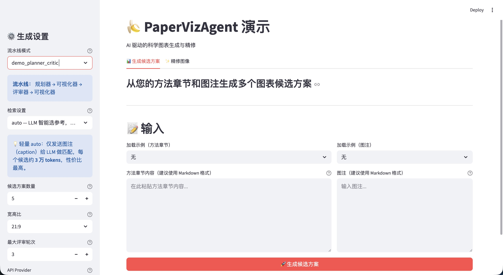
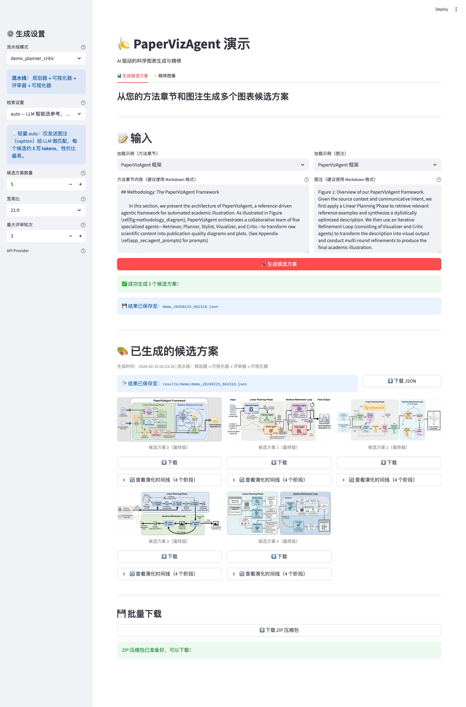
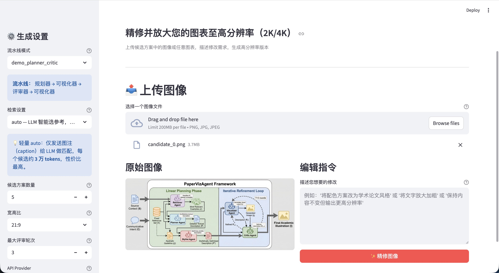
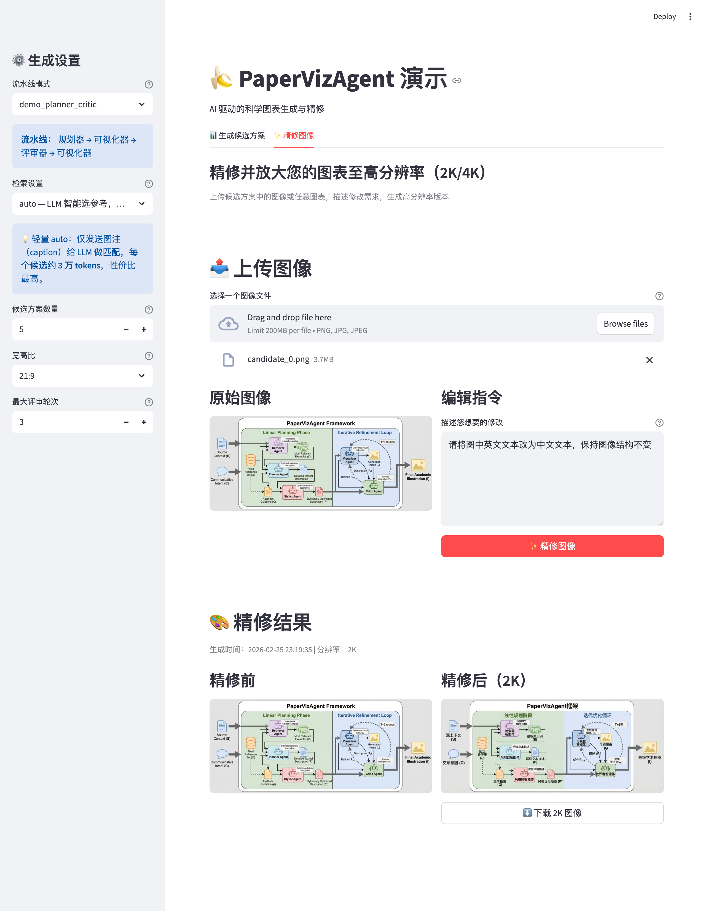

# PaperBanana-AIMSLab 学术配图助手 🍌

AI 驱动的学术论文配图生成工具 — 粘贴论文方法章节，自动生成高质量学术配图。

[](https://github.com/zhouzhq2021/PaperBanana-AIMSLab/stargazers)
[](https://github.com/zhouzhq2021/PaperBanana-AIMSLab/forks)
[](https://github.com/zhouzhq2021/PaperBanana-AIMSLab/issues)

> 本项目最初是为支持 **AIMSLab** 在论文配图生成中的实际使用需求而开发，现在整理为面向更广泛科研用户的中文增强版本。项目基于开源项目 [PaperBanana](https://github.com/dwzhu-pku/PaperBanana)（[论文](https://huggingface.co/papers/2601.23265)）优化而来，重点改进国内可用性、多 API 通道容错和交互体验。

默认 API 网关已配置为 `https://api.aipaibox.com`，同时保留 Google Gemini 官方 endpoint、OpenAI 官方 API 和兼容网关通道。



---

## 项目热度统计

欢迎给项目点一个 Star，Star 数会直接显示在上方徽章中，也能帮助更多需要论文配图工具的同学发现这个项目：

**[⭐ Star PaperBanana-AIMSLab](https://github.com/zhouzhq2021/PaperBanana-AIMSLab)**

[](https://www.star-history.com/#zhouzhq2021/PaperBanana-AIMSLab&Date)

---

## 最新更新

### 多渠道自动切换，解决国内 API 不稳定痛点

之前版本主要依赖少数 API 通道，实际使用中如果遇到国内网关超时、限流、返回空结果或临时不可用，就需要手动切换配置，批量生成时很容易中断。

现在已支持 **AIPAIBOX / Google Gemini 官方 endpoint / OpenAI 官方 API / Evolink 兼容通道**，并在调用层加入自动 fallback：

- 侧边栏不再要求手动选择 Provider，只需要选择文本模型和图像模型。
- 系统会根据可用 API Key 自动选择通道。
- 遇到超时、异常、返回 `Error` 或初始化失败时，会自动尝试下一条可用通道。
- 自动 fallback 现在按 **模型@通道** 粒度工作：例如 `gemini-2.5-flash@aipaibox` 失败后，不会阻塞 `gpt-5.5@aipaibox` 或 `gpt-5.4@aipaibox`。
- 每个模型通道组合会先完成指数退避重试，再临时暂停该组合，避免“一次失败就熔断”，也避免国内不稳定环境下反复卡住。
- 文本模型不再局限于 Gemini 系列，可使用 `gpt-5.5`、`gpt-5.4` 等 OpenAI 系列模型。

默认策略已经针对国内不稳定网络做了平衡：文本通道使用较短退避，图像通道使用更长退避；`gpt-image-2` 不稳定时会自动尝试 Gemini 图像模型。高级用户可以通过环境变量覆盖重试次数、退避时间和模型 fallback 顺序，但日常使用通常无需调整。

### 支持 OpenAI `gpt-image-2`

图像生成和图像精修新增 `gpt-image-2` 支持：

- 可在图像模型下拉框中直接选择 `gpt-image-2`。
- 支持纯文本生成图像。
- 支持 image-to-image 精修，上传已有图表后根据编辑指令生成新版本。
- 与自动通道切换联动：优先尝试可用网关，失败后可切换到 OpenAI 官方 API。

---

## 功能介绍

### 📊 生成候选配图

粘贴论文的**方法章节**和**图注**，自动生成多个候选配图供你挑选。



背后是 5 个 AI Agent 协作的流水线：

```
检索器 → 规划器 → 风格化器 → 可视化器 → 评审器
  │         │          │           │          │
从参考库  将文字转为  优化学术    生成图像   审查图像
找类似图  图表描述    美学风格              提出改进
```

评审器和可视化器会自动迭代 3 轮，逐步优化图表质量。

- 支持并行生成 1-20 个候选方案
- 支持 21:9 / 16:9 / 3:2 等宽高比
- 每个候选可查看演化时间线（每个阶段的中间结果）
- 单张下载 / ZIP 批量下载 / JSON 完整结果导出



### ✨ 图片精修

上传已生成的配图或任意图片，描述修改需求，生成 2K/4K 高分辨率版本。



- 支持 image-to-image 编辑（基于原图修改）
- 支持纯文字描述重新生成
- 支持放大到 2K / 4K 分辨率



### 💰 智能检索，省 96% API 费用

原版 PaperBanana 的参考图检索会把 200 篇论文**全文**塞进 prompt，单次消耗 **~80 万 tokens**。我们优化为默认仅发送图注，降至 **~3 万 tokens**，效果基本不变。

| 检索模式 | Token 消耗/候选 | 说明 |
|---------|:-----------:|------|
| `auto` | ~3 万 | LLM 智能匹配参考图，仅发送图注 **（推荐）** |
| `auto-full` | ~80 万 | 发送完整论文文本，高精度但费用高 |
| `random` | 0 | 随机选 10 个参考，不调 API |
| `none` | 0 | 不使用参考图 |

> 默认配置（5 候选 + `auto`）比原版省 **96%** 检索费用，界面上每种模式都有费用提示，不会踩坑。

### 🔧 多 API 支持

内置多种 API 通道，开箱即用：

| 模式 | 说明 | 网络要求 |
|------|------|---------|
| **AIPAIBOX**（默认） | `https://api.aipaibox.com`，OpenAI-compatible 国内网关 | 无需翻墙 |
| **Google Gemini** | Google 官方 Gemini endpoint | 需要科学上网 |
| **OpenAI** | OpenAI 官方 API，支持文本模型和 `gpt-image-2` | 需要可访问 OpenAI |
| **Evolink** | 兼容旧配置的国内 API 代理 | 无需翻墙 |

在界面侧边栏选择文本模型和图像模型即可；系统会根据可用 API Key 自动选择通道，遇到超时或返回 `Error` 时会尝试切换到下一条可用通道。

图像模型在网关侧会自动区分端点：`gpt-image-2` 文本生图使用 OpenAI-compatible `/v1/images/generations`，带输入图精修使用 `/v1/images/edits`，`gemini-3.1-flash-image-preview` 使用 Gemini `/v1beta/models/{model}:generateContent`，避免不同模型误打到错误接口。

> **说明**：本工具与 AIPAIBOX/Evolink 无任何商业关联，仅作为内置的国内可用 API 方案提供。项目采用 Provider 抽象架构（见 `providers/` 目录），你可以自行集成任何兼容 OpenAI 接口的 API 服务商。

---

## 快速开始

### 第一步：获取 API Key

**推荐 AIPAIBOX（国内直连）**：在 `configs/model_config.yaml` 中填写 `aipaibox.gemini_api_key` 和 `aipaibox.openai_api_key`，默认地址为 `https://api.aipaibox.com`。如果你的网关账号仍然是一把通用 key，也可以继续填写兼容字段 `aipaibox.api_key`。

也可以用 Google Gemini：前往 https://aistudio.google.com/apikey 获取，并填写 `api_keys.google_api_key`。

如需使用 OpenAI 文本模型或 `gpt-image-2`，填写 `api_keys.openai_api_key`，并在界面下拉框选择对应模型。

如需通过中转访问 Google 或 OpenAI，可在 `configs/model_config.yaml` 中配置 `google.base_url` 或 `openai.base_url`。

### 第二步：启动程序

**macOS 用户**：双击 `mac-start.command`

**Windows 用户**：双击 `win-start.bat`

> Windows 提示：如果本地没有安装 Python，建议先打开 Microsoft Store 搜索 **"Python 3.12"** 安装，再运行脚本，避免自动安装耗时过长。

首次启动会自动完成以下操作（约 2-3 分钟）：
1. 检测或自动安装 Python（>= 3.10）
2. 创建虚拟环境
3. 安装所有依赖
4. 启动程序并自动打开浏览器

之后每次启动只需几秒。

### （可选）下载参考数据集

程序内置了「检索 Agent」，可以从参考图库中找到相似的学术配图作为生成参考，提升生成质量。如需此功能，请下载数据集：

1. 前往 [PaperBananaBench](https://huggingface.co/datasets/dwzhu/PaperBananaBench) 下载数据集
2. 将下载的内容放到项目的 `data/PaperBananaBench/` 目录下，结构如下：

```
data/
└── PaperBananaBench/
    ├── diagram/
    │   ├── images/        ← 论文配图图片
    │   ├── ref.json       ← 参考数据
    │   └── test.json
    └── plot/
        ├── images/        ← 论文图表图片
        ├── ref.json
        └── test.json
```

> 不下载也能正常使用，只需在侧边栏将「检索设置」改为 `none`，此时跳过参考图检索，不影响其他功能。

### 第三步：使用

1. 在左侧边栏选择 API 提供商，填入 API Key
2. 切换到「生成候选方案」标签页
3. 粘贴论文方法章节内容 + 图注
4. 点击「生成候选方案」，等待几分钟
5. 从生成的多个候选图中挑选满意的下载

---

## 侧边栏设置说明

| 设置项 | 说明 |
|--------|------|
| API Keys | 填写可用通道的密钥；通道由系统自动选择 |
| 文本模型 | 用于规划/评审的模型（如 gpt-5.5、gpt-5.4、gemini-2.5-flash），支持下拉选择和自定义输入 |
| 图像模型 | 用于生成图片的模型（gpt-image-2、gemini-3.1-flash-image-preview），支持下拉选择和自定义输入 |
| 流水线模式 | `demo_planner_critic`（快速）或 `demo_full`（含风格化，更美观） |
| 检索设置 | auto / auto-full / random / none，详见上方 [检索费用对比](#-智能检索省-96-api-费用) |
| 候选方案数量 | 1-20，建议 3-5 个 |
| 宽高比 | 21:9 / 16:9 / 3:2 |
| 最大评审轮次 | 1-5，默认 3 轮 |

---

## 手动安装（可选）

如果一键脚本有问题，可以手动安装：

```bash
# 1. 确保已安装 Python 3.10+
python3 --version

# 2. 创建虚拟环境
python3 -m venv .venv
source .venv/bin/activate   # macOS/Linux
# .venv\Scripts\activate    # Windows

# 3. 安装依赖
pip install -r requirements.txt

# 4. 启动
streamlit run demo.py --server.port 8501
```

```bash
# 1. 使用uv
uv sync

# 2. 激活环境
source .venv/bin/activate

# 3. 启动
streamlit run demo.py --server.port 8501
```

浏览器打开 http://localhost:8501 即可使用。

---

## 常见问题

**Q: 启动时报错找不到 Python？**
A: 一键脚本会自动下载便携版 Python，请确保网络通畅。也可以手动安装 Python 3.10+ 后重试。

**Q: AIPAIBOX、Gemini 和 OpenAI 有什么区别？**
A: AIPAIBOX 是国内可访问的 OpenAI-compatible 网关；Gemini 是 Google 官方接口；OpenAI 是官方 OpenAI 接口，可使用 OpenAI 文本模型和 `gpt-image-2`。

**Q: 生成一次大概花多少钱？**
A: 取决于候选数量和检索模式。默认配置（5 候选 + `auto` 检索）约消耗 15 万文本 tokens + 5 次图像生成。比原版省 96% 检索费用。具体价格请查看 API 服务商的定价页面。

**Q: 生成需要多久？**
A: 5 个候选方案通常需要 10-15 分钟。单个候选约 2-3 分钟。

**Q: 可以不用参考数据集吗？**
A: 可以。将检索设置改为 `none` 即可，此时不需要 `data/` 目录中的数据集。

**Q: 可以在界面上换模型吗？**
A: 可以。侧边栏的「文本模型」和「图像模型」支持下拉选择，也支持自定义输入。文本模型不再局限于 Gemini 系列；选择 OpenAI 文本模型或 `gpt-image-2` 时，系统会自动使用可用的 OpenAI/AIPAIBOX 通道。

**Q: Windows 上报错 `module 'time' has no attribute 'tzset'`？**
A: 已修复。请拉取最新代码（`git pull`）即可解决。

**Q: 如何停止程序？**
A: macOS 在终端按 `Ctrl+C`；Windows 关闭命令行窗口即可。

**Q: 如何集成其他 API 服务商？**
A: 参照 `providers/base.py` 定义的接口，实现 `generate_text()` 和 `generate_image()` 两个方法即可。可以参考 `providers/gateway.py` 的实现；`providers/evolink.py` 仅保留为旧导入路径兼容层。

---

## 致谢

本项目基于 [PaperBanana](https://github.com/dwzhu-pku/PaperBanana) 开源项目改造。原始论文：

```
Zhu, Dawei, et al. "PaperBanana: Automating Academic Illustration for AI Scientists."
arXiv preprint arXiv:2601.23265 (2026).
```

许可证：Apache-2.0
